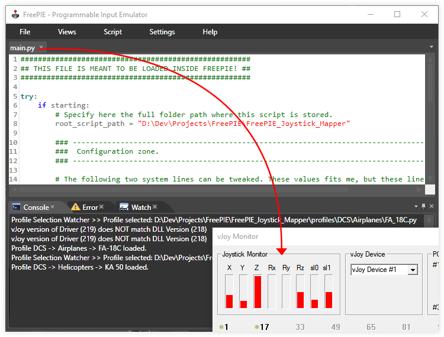

# FreePIE Joystick Mapper
A bundle of scripts operating together to offer mapping functionalities to your joystick with the help of [FreePIE](http://andersmalmgren.github.io/FreePIE/). Physical axes can be mapped to virtual ones ([vJoy](https://sourceforge.net/projects/vjoystick/)) and physical buttons/switches can also be mapped to virtual ones and/or can simulate keyboard presses. Tested on FreePIE 1.11.724.0.



## State of the project
The project is **NOT a finished product** as per my final vision, but still in a functionning state.

Because through time the work with FreePIE brought frustrations from hair pulling contraints (e.g. the inability to efficiently track back execution errors with correct line numbers), the project's progress will depend on my mood and personal needs.

The project is very well usable (a lot of efforts and time was spent to control errors, especially with profile building, despite constraints): I use it myself. However at the current state it is foremost meant for people who knows how to handle python (probably devs) and can see where I was going on with the design (profile building at the minimum). Some hints will be given though.

**In summary the project is presently not meant for mainstream usage UNLESS you can understand how it works**.

## Basic concept of how this works
The project uses profiles defined by an user to determine which mappings to do. A profile is defined in a single file and must stay inside the `profiles` folder or any of its subfolders you may have created. When FreePIE is running it will load a profile you selected and everything else is automated.

## How to use
1. `main.py` found at the root of the project is the starting point you'll have to load inside FreePIE.
2. In this file you'll have to modify the variable `root_script_path` and set it to the path where `main.py` resides.
3. Set up your profiles and select one to be loaded (see below [Setting up a profile](#setting-up-a-profile-how-it-works) and  [Selecting a profile](#selecting-a-profile)).
4. Run the script from FreePIE top menu: `Script -> Run script`. The console at the bottom and a Windows notification will tell you if the profile is correctly loaded.

## Be mindful of these limitations
- FreePIE is unable to find by itself the project's root where `main.py` and all of its scripts reside. That's why we have to help him by setting a variable as explained in the '[How to use](#how-to-use)' section.
- The filename of a profile must not contain any dash (-) separator. The file is a Python module to be loaded and Python doesn't allow any dash.
- Be mindful when doing code changes that FreePIE executes on Python 2.7.
- If you want your code changes to be applied it is advised you restart FreePIE to avoid any side effects since Python is holding references in memory while FreePIE is running. This does not apply if you make profile changes as you can make any change and they will be applied within one FreePIE session (see [HOT reload](#profiles-hot-reload)).
- Multiple concurrent devices mapping is not yet possible. It is meant to happen, but it is still not fully implemented (work on it has already started). As an example, a HOTAS X52 can be fully mapped since it is recognized as a single unit.

## Project folders structure

### Related to the automated scripts
- ***profiles:*** folder containing all the profiles files describing desired mappings
    - ***tables:*** folder containing hand-made reference tables to describe a joystick' properties for further references
- ***src:*** folder containing the source code of the automated scripts loaded into FreePIE.

### Unrelated to the automated scripts
- ***extra:*** folder containing some extra contents unrelated to the automated scripts execution
    - ***_geogebra:*** contains a file which holds the mathematical expressions to construct a custom curve. It is useful as you get a direct visual feedback by changing parameters.
    - ***_labs:*** a place where some testing were made for different purpose. It is kept as a future reference, but should not be used. Some parts doesn't work anymore.
- ***_res:*** contains resources for this repository home page (e.g. images)

## Profiles organization (subfolders)
It is possible to have subfolders in `/profiles/` to hold profiles for organization purpose. Any number of subfolders can be created. 

***Remark:*** \_\_init\_\_.py is a necessary file to be present for each folder leading to a profile (starting from `/profiles/`). This file is an empty file. The software will automatically create this file for you and you should not delete it (it will be created again automatically).

## Setting up a profile: how it works
Take a look at [_SYNTAX_REFERENCE.txt](./profiles/_SYNTAX_REFERENCE.txt), [__TEMPLATE.py](./profiles/__TEMPLATE.py) and also take a look at a created profile in the profiles folder to get an idea of how to build a mapping. The main idea is you create a joystick instance with `joy(joy_name, joy_axis_max)` in a `_mapping` function and specify mappings on it. Once finished, you return the joystick instance.

The name of a function building a mapping must end with `_mapping` and anything can be written before. The [profile loader](./src/loader/profile_loader.py) will handle the rest and doesn't care what is written before `_mapping`.

### Mapping features available at a glance
- ***Buttons / Switches / POVs:***
  - Virtual button (vJoy)
  - Virtual pov (vJoy)
  - Keyboard input
  - Rotating keyboard inputs :
    List of inputs to rotate on each button press
  - Text-To-Speech :
    Make an action trigger a voice reading predefined text
  - Label :
    Only useful for keeping track of what the mappings do
  - Modifiers : 
    Multiple layer of mappings on one button
  - Copy mappings : 
    Copy an already defined mappings from another button

- ***Axes***:
  - Virtual axis (vJoy)
  - Axis inversion
  - Axis curve
    - Linearity
    - Curvature
    - Deadzone
    - Saturation X/Y
    - Max value
  - Filters
    - Noise reduction (Kalman, Low Pass)
    - Min/Max
  - Threshold action (available, but needs work)
  - Transfer range (available, but needs work)
  
## Selecting a profile
Profile selection is done from the file `profile_selected.txt`. This file lives at the root (same folder as `main.py`).
  
To select a profile you need to specify its path starting from `/profiles/` (not included) at the last line of `profile_selected.txt` and the extension .py of the filename is not necessary (but can be included if you really desire so). Blank spaces before and after the profile path is authorized. Anything can be wrote before it if you want.

As an example, a last line of `DCS/Airplanes/FA_18C` in `profile_selected.txt` means we select the profile `/profiles/DCS/Airplanes/FA_18C.py` to be loaded.

Another example with more contents in a `profile_selected.txt`:
```
The following lines are personnal notes that can stay in the file and won't cause any problem.

>> DCS AIRPLANES
    DCS/Airplanes/FA_18C
    DCS/Airplanes/A10C_II

>> DCS HELICOPTERS
    DCS/Helicopters/Huey_UH_1H

// Profile selection happens below (at the last line)
DCS/Airplanes/A10C_II
```

In this example, the profile selected and that will be loaded is: `profiles/DCS/Airplanes/A10C_II.py`.

## Profiles HOT reload
It is possible to change the selected profile while the software is running and it will automatically load the new selected profile for you and you don't need to do anything or restart.

Similarly, if you make mappings modification inside a profile already loaded then the new state will be automatically loaded for you.

## Tip on script launching
It is possible to launch FreePIE and have the automated script to be launched right away without you fiddling with the FreePIE interface. To do so, make a shortcut of your `FreePIE.exe` and add the following arguments:\
`"Your main.py full path" /tray /run`

As an example, the full path of my shortcut looks like this:
`"C:\Program Files (x86)\FreePIE\FreePIE.exe" "D:\Dev\Projects\FreePIE\FreePIE_Joystick_Mapper\main.py" /tray /run`

## Note on vJoy version mismatch
If you are using the vJoy driver version 2.1.9 (219), don't worry about the message in the console saying it doesn't match the DLL version (218). They are basically the same. 219 is just meant for Windows 10 compatibilty with no meaningful change. 219 driver is totally compatible with the 218 DLL provided with FreePIE.

## License

The project is released under the [MIT](./LICENSE.md) license.
